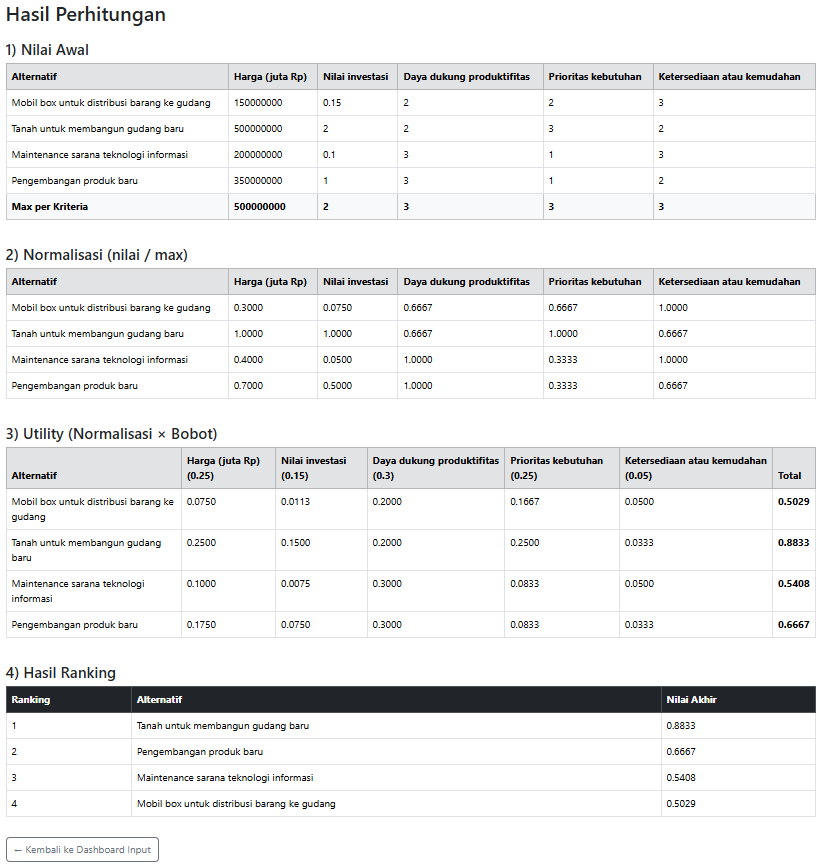

# 📊 Decision Support System using SMART Method

This project is a **Decision Support System (DSS)** implementation using the **SMART (Simple Multi-Attribute Rating Technique)** method, built with **PHP & MySQL**.  
It allows users to manage **criteria**, **alternatives**, input decision matrix values, and calculate **final ranking results**.

---

## 📑 Table of Contents
- [✨ Features](#-features)  
- [🛠️ Tech Stack](#️-tech-stack)  
- [📂 Project Structure](#-project-structure)  
- [🗄️ Database Structure](#️-database-structure)  
- [🚀 How to Run](#-how-to-run)  
- [📖 SMART Method](#-smart-method)  
- [📸 Preview](#-preview)  

---

## ✨ Features
- Manage Criteria (CRUD)  
- Manage Alternatives (CRUD)  
- Input Decision Matrix  
- Data Normalization (SMART method)  
- Utility & Total Score Calculation  
- Ranking Results Display  

---

## 🛠️ Tech Stack
- **Backend**: PHP (Native)  
- **Database**: MySQL  
- **Frontend**: HTML, CSS, Bootstrap 5  
- **Local Server**: XAMPP / Laragon  

---

## 📂 Project Structure

├── config.php         
├── index.php             
├── hitung.php          
└── README.md           

---

## 🗄️ Database Structure
**Database name:** `db_smart`

### 1. Table `kriteria`
| Column  | Type     | Description             |
|---------|----------|-------------------------|
| id      | INT (AI) | Primary Key             |
| nama    | VARCHAR  | Criteria name           |
| bobot   | FLOAT    | Criteria weight (0–1)   |

### 2. Table `alternatif`
| Column  | Type     | Description             |
|---------|----------|-------------------------|
| id      | INT (AI) | Primary Key             |
| nama    | VARCHAR  | Alternative name        |

### 3. Table `nilai`
| Column        | Type     | Description                         |
|---------------|----------|-------------------------------------|
| id            | INT (AI) | Primary Key                         |
| id_alternatif | INT      | Foreign key → `alternatif` table    |
| id_kriteria   | INT      | Foreign key → `kriteria` table      |
| nilai         | FLOAT    | Score for alternative × criteria    |

---

## 🚀 How to Run
1. Clone or download this repository.  
2. Place the project folder inside `htdocs` (if using XAMPP).  
3. Create a new database named **`db_smart`**.  
4. Import the tables as described above.  
5. Update database config inside `config.php`:  

   ```php
   $host = "localhost";
   $user = "root";
   $pass = "";
   $db   = "db_smart";

6. Start Apache & MySQL from XAMPP.
7. Open the project in your browser:
   http://localhost/project-folder-name

---

## 📖 SMART Method
1. **Input Scores** → Enter values for each alternative against criteria.  
2. **Normalization** → Divide each score by the maximum score per criterion.  
3. **Utility Calculation** → Multiply normalized score × criteria weight.  
4. **Total Score** → Sum all utilities for each alternative.  
5. **Ranking** → Sort alternatives by total score (highest = best).  

---

## 📸 Preview
### Dashboard


### Ranking Result


   

